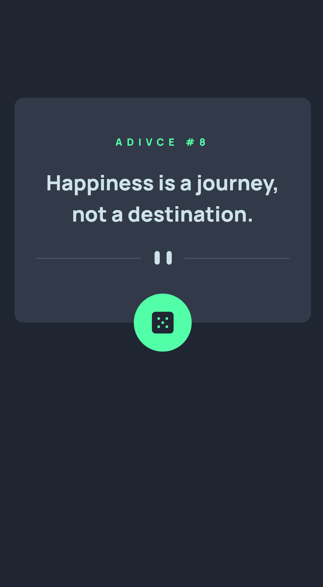
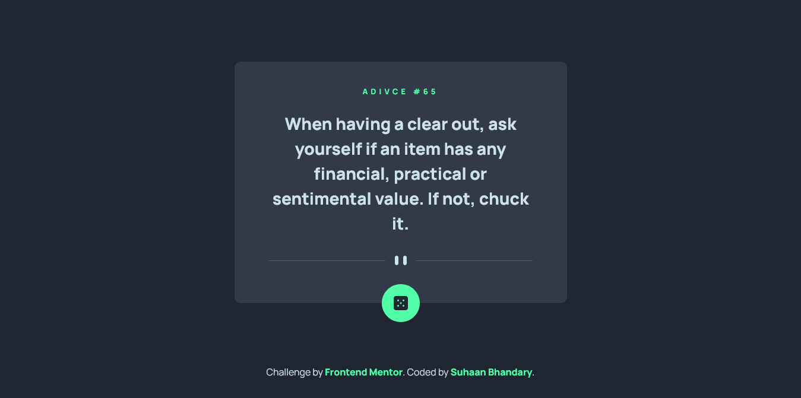

# Frontend Mentor - Advice generator app

This is a solution to the [Advice generator app challenge on Frontend Mentor](https://www.frontendmentor.io/challenges/advice-generator-app-QdUG-13db).
Try it yourself 😀

## Table of contents

- [Frontend Mentor - Advice generator app](#frontend-mentor---advice-generator-app)
  - [Table of contents](#table-of-contents)
  - [Overview](#overview)
    - [The challenge](#the-challenge)
    - [Screenshot](#screenshot)
    - [Links](#links)
    - [Built with](#built-with)
    - [Motive](#motive)
  - [Author](#author)

## Overview

### The challenge

Users should be able to:

- Display a random Advice on a Click
- Get random Advice from an API
- Using SVG in design

### Screenshot

### Links

- Solution URL: [https://github.com/Suhaan-Bhandary/AdviceGenerator](https://github.com/Suhaan-Bhandary/AdviceGenerator)
- Live Site URL: [https://suhaan-bhandary.github.io/AdviceGenerator/](https://suhaan-bhandary.github.io/AdviceGenerator)

### Built with

- Semantic HTML5 markup
- CSS custom properties
- Flexbox
- CSS Grid
- Mobile-first workflow
- Javascrip
- API Call using Fetch

### Motive

Brushing up the CSS skills and having fun!!

## Author

- LinkedIn - [Suhaan-Bhandary](https://www.linkedin.com/in/suhaan-bhandary)
- Frontend Mentor - [@Suhaan-Bhandary](https://www.frontendmentor.io/profile/Suhaan-Bhandary)
